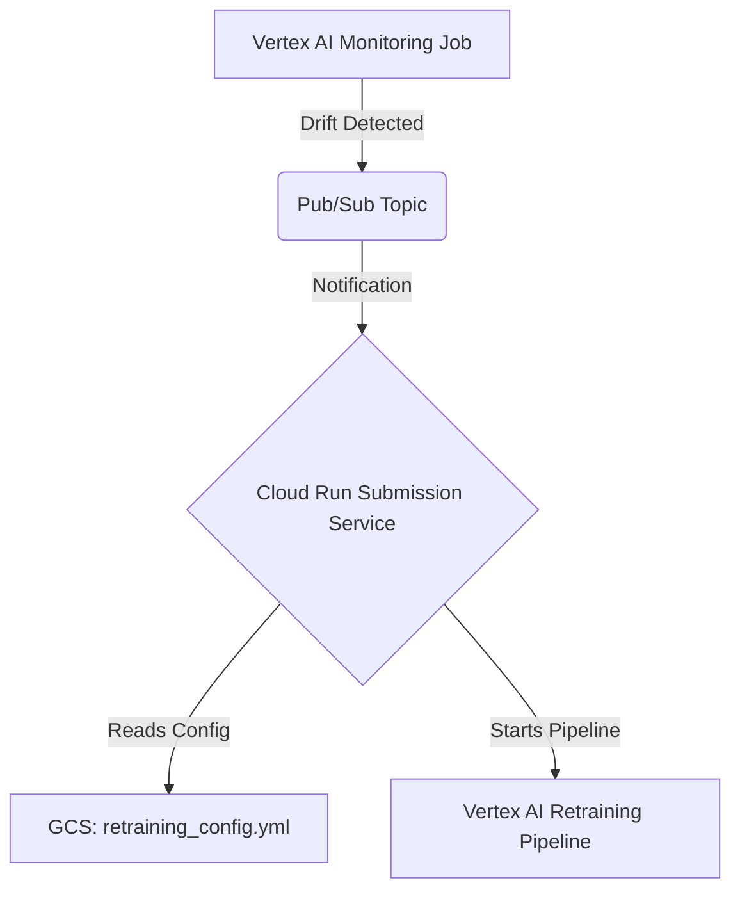

# Automating Model Retraining with Vertex AI Monitoring

This guide explains how to configure your project to automatically trigger a model retraining pipeline when performance degradation or data drift is detected by a Vertex AI Model Monitoring job.

## How it Works

The auto-retraining process is event-driven and uses several connected components within the MLOps Framework and the Google Cloud ecosystem.

1.  **Drift Detection**: A deployed Vertex AI Model Monitoring job continuously analyzes prediction data. When it detects that drift has crossed a predefined threshold, it fires an alert.
2.  **Notification**: The monitoring job sends a notification message to a designated Cloud Pub/Sub topic.
3.  **Triggering**: A Cloud Run based Submission Service is configured to listen to this Pub/Sub topic. The arrival of a message triggers the service.
4.  **Pipeline Execution**: The Submission Service reads a configuration file from Google Cloud Storage (GCS) that contains the specifications for the retraining pipeline. It then uses this information to launch a new Vertex AI Pipeline run to retrain the model.



## Configuration Pre-requisites

To enable auto-retraining, you need to provide specific settings in your pipeline's general configuration file ( `config/general_config.yml`). This configuration tells the MDK framework to prepare the necessary artifacts and settings during the monitoring setup phase.

### Required Parameters

You will need to modify the `monitoring` section of your configuration file.

Here is a sample YAML snippet showing the required parameters.

```yaml
# ... other general config ...

monitoring:
  # ... other monitoring settings ...

  retraining:
    # This is the switch to enable the auto-retraining setup.
    # Set this to true to enable the capability.
    set_up_retraining: true

    # The root of your application directory. This is needed to locate
    # the pipeline configuration files for compilation.
    app_root: "<path/to/your/app/root>"

    # The name of the training pipeline to be triggered. This must match
    # the name of a pipeline defined in your project's pipeline mapping.
    training_pipeline_name: "main_training_pipeline"

    # The name of the inference pipeline to be compiled and stored.
    # This is often the same as the training pipeline but can be different.
    inference_pipeline_name: "main_inference_pipeline"

gcp:
  # ... other gcp settings ...

  # The Pub/Sub topic that the Vertex AI Monitoring job will send alerts to.
  # This topic must exist in your GCP project.
  # Format: projects/your-project-id/topics/your-topic-name
  notification_channels:
    - "projects/your-gcp-project-id/topics/your-monitoring-alerts-topic"

# ... other gcp settings ...
```

### Parameter Explanations

-   `monitoring.retraining.set_up_retraining`: (Boolean) Set this to `true` to activate the auto-retraining setup. If `false` or omitted, the necessary artifacts will not be generated.
-   `monitoring.retraining.app_root`: (String) The absolute path to your application's root directory. The MDK needs this to find and compile the training and inference pipelines.
-   `monitoring.retraining.training_pipeline_name`: (String) The name of the pipeline to run when retraining is triggered. This name must correspond to a pipeline defined in your project.
-   `monitoring.retraining.inference_pipeline_name`: (String) The name of the inference pipeline that will be compiled and saved. This is for consistency and to ensure the newly retrained model can be deployed with the correct pipeline.
-   `gcp.notification_channels`: (List of Strings) A list of Pub/Sub topics or other notification channels. For auto-retraining, you must include the Pub/Sub topic that your trigger Cloud Run Submission Service is subscribed to.


## Verifying the Setup

After your pipeline has run, you can verify that the setup was successful:

1.  **Check GCS**: Navigate to your GCS bucket and look for a folder named `retraining-configs/monitor-...`. Inside, you should find the compiled pipeline specs and the `retraining_config.yml`.
2.  **Check Vertex AI**: In the Google Cloud Console, go to the Vertex AI Model Monitoring section and inspect your monitoring job. Under the "Alerting" or "Notifications" tab, you should see your Pub/Sub topic listed as a notification channel.
3.  **Check Cloud Run Logs**: When a retraining event is triggered, you can view the logs of your Cloud Run to see its execution details and any potential errors.
